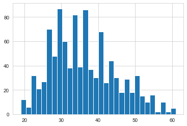
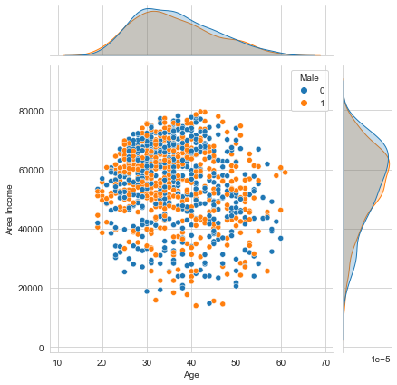
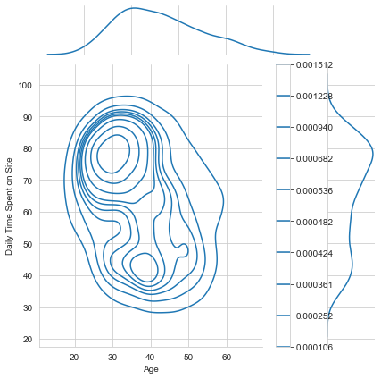
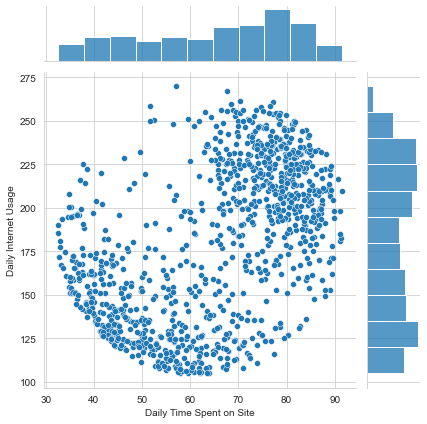
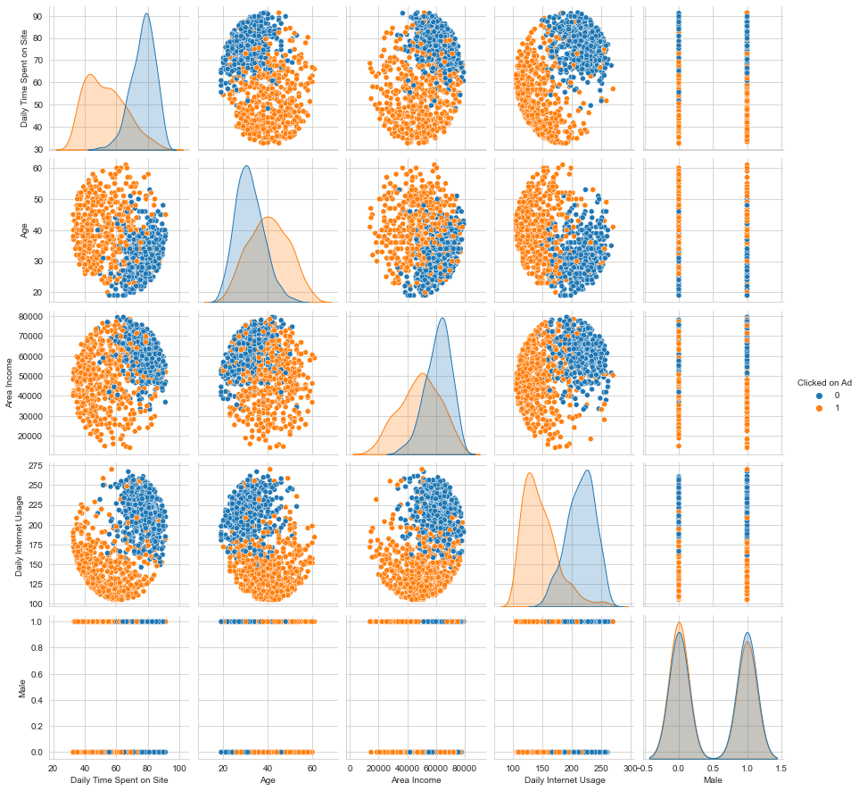

# Project: Prediction of users' engagement using advertising data set.

Create a model that will predict whether or not customer will click on an ad based off the features of that user.

This data set contains the following features:

* 'Daily Time Spent on Site': consumer time on site in minutes
* 'Age': cutomer age in years
* 'Area Income': Avg. Income of geographical area of consumer
* 'Daily Internet Usage': Avg. minutes a day consumer is on the internet
* 'Ad Topic Line': Headline of the advertisement
* 'City': City of consumer
* 'Male': Whether or not consumer was male
* 'Country': Country of consumer
* 'Timestamp': Time at which consumer clicked on Ad or closed window
* 'Clicked on Ad': 0 or 1 indicated clicking on Ad

## Import Libraries


```python
import pandas as pd
import numpy as np
import matplotlib.pyplot as plt
import seaborn as sns 
%matplotlib inline
```

## Get the Data
**Read in the advertising.csv file and set it to a data frame called ad_data.**


```python
ad_data = pd.read_csv('advertising.csv')
```

**Check the head of ad_data**


```python
ad_data.head()
```


<div>
<style scoped>
    .dataframe tbody tr th:only-of-type {
        vertical-align: middle;
    }

    .dataframe tbody tr th {
        vertical-align: top;
    }

    .dataframe thead th {
        text-align: right;
    }
</style>
<table border="1" class="dataframe">
  <thead>
    <tr style="text-align: right;">
      <th></th>
      <th>Daily Time Spent on Site</th>
      <th>Age</th>
      <th>Area Income</th>
      <th>Daily Internet Usage</th>
      <th>Ad Topic Line</th>
      <th>City</th>
      <th>Male</th>
      <th>Country</th>
      <th>Timestamp</th>
      <th>Clicked on Ad</th>
    </tr>
  </thead>
  <tbody>
    <tr>
      <th>0</th>
      <td>68.95</td>
      <td>35</td>
      <td>61833.90</td>
      <td>256.09</td>
      <td>Cloned 5thgeneration orchestration</td>
      <td>Wrightburgh</td>
      <td>0</td>
      <td>Tunisia</td>
      <td>2016-03-27 00:53:11</td>
      <td>0</td>
    </tr>
    <tr>
      <th>1</th>
      <td>80.23</td>
      <td>31</td>
      <td>68441.85</td>
      <td>193.77</td>
      <td>Monitored national standardization</td>
      <td>West Jodi</td>
      <td>1</td>
      <td>Nauru</td>
      <td>2016-04-04 01:39:02</td>
      <td>0</td>
    </tr>
    <tr>
      <th>2</th>
      <td>69.47</td>
      <td>26</td>
      <td>59785.94</td>
      <td>236.50</td>
      <td>Organic bottom-line service-desk</td>
      <td>Davidton</td>
      <td>0</td>
      <td>San Marino</td>
      <td>2016-03-13 20:35:42</td>
      <td>0</td>
    </tr>
    <tr>
      <th>3</th>
      <td>74.15</td>
      <td>29</td>
      <td>54806.18</td>
      <td>245.89</td>
      <td>Triple-buffered reciprocal time-frame</td>
      <td>West Terrifurt</td>
      <td>1</td>
      <td>Italy</td>
      <td>2016-01-10 02:31:19</td>
      <td>0</td>
    </tr>
    <tr>
      <th>4</th>
      <td>68.37</td>
      <td>35</td>
      <td>73889.99</td>
      <td>225.58</td>
      <td>Robust logistical utilization</td>
      <td>South Manuel</td>
      <td>0</td>
      <td>Iceland</td>
      <td>2016-06-03 03:36:18</td>
      <td>0</td>
    </tr>
  </tbody>
</table>
</div>


** Use info and describe() on ad_data**


```python
ad_data.info
```


    <bound method DataFrame.info of      Daily Time Spent on Site  Age  Area Income  Daily Internet Usage  \
    0                       68.95   35     61833.90                256.09   
    1                       80.23   31     68441.85                193.77   
    2                       69.47   26     59785.94                236.50   
    3                       74.15   29     54806.18                245.89   
    4                       68.37   35     73889.99                225.58   
    ..                        ...  ...          ...                   ...   
    995                     72.97   30     71384.57                208.58   
    996                     51.30   45     67782.17                134.42   
    997                     51.63   51     42415.72                120.37   
    998                     55.55   19     41920.79                187.95   
    999                     45.01   26     29875.80                178.35   
    
                                 Ad Topic Line            City  Male  \
    0       Cloned 5thgeneration orchestration     Wrightburgh     0   
    1       Monitored national standardization       West Jodi     1   
    2         Organic bottom-line service-desk        Davidton     0   
    3    Triple-buffered reciprocal time-frame  West Terrifurt     1   
    4            Robust logistical utilization    South Manuel     0   
    ..                                     ...             ...   ...   
    995          Fundamental modular algorithm       Duffystad     1   
    996        Grass-roots cohesive monitoring     New Darlene     1   
    997           Expanded intangible solution   South Jessica     1   
    998   Proactive bandwidth-monitored policy     West Steven     0   
    999        Virtual 5thgeneration emulation     Ronniemouth     0   
    
                        Country            Timestamp  Clicked on Ad  
    0                   Tunisia  2016-03-27 00:53:11              0  
    1                     Nauru  2016-04-04 01:39:02              0  
    2                San Marino  2016-03-13 20:35:42              0  
    3                     Italy  2016-01-10 02:31:19              0  
    4                   Iceland  2016-06-03 03:36:18              0  
    ..                      ...                  ...            ...  
    995                 Lebanon  2016-02-11 21:49:00              1  
    996  Bosnia and Herzegovina  2016-04-22 02:07:01              1  
    997                Mongolia  2016-02-01 17:24:57              1  
    998               Guatemala  2016-03-24 02:35:54              0  
    999                  Brazil  2016-06-03 21:43:21              1  
    
    [1000 rows x 10 columns]>


```python
ad_data.describe()
```


<div>
<style scoped>
    .dataframe tbody tr th:only-of-type {
        vertical-align: middle;
    }

    .dataframe tbody tr th {
        vertical-align: top;
    }

    .dataframe thead th {
        text-align: right;
    }
</style>
<table border="1" class="dataframe">
  <thead>
    <tr style="text-align: right;">
      <th></th>
      <th>Daily Time Spent on Site</th>
      <th>Age</th>
      <th>Area Income</th>
      <th>Daily Internet Usage</th>
      <th>Male</th>
      <th>Clicked on Ad</th>
    </tr>
  </thead>
  <tbody>
    <tr>
      <th>count</th>
      <td>1000.000000</td>
      <td>1000.000000</td>
      <td>1000.000000</td>
      <td>1000.000000</td>
      <td>1000.000000</td>
      <td>1000.00000</td>
    </tr>
    <tr>
      <th>mean</th>
      <td>65.000200</td>
      <td>36.009000</td>
      <td>55000.000080</td>
      <td>180.000100</td>
      <td>0.481000</td>
      <td>0.50000</td>
    </tr>
    <tr>
      <th>std</th>
      <td>15.853615</td>
      <td>8.785562</td>
      <td>13414.634022</td>
      <td>43.902339</td>
      <td>0.499889</td>
      <td>0.50025</td>
    </tr>
    <tr>
      <th>min</th>
      <td>32.600000</td>
      <td>19.000000</td>
      <td>13996.500000</td>
      <td>104.780000</td>
      <td>0.000000</td>
      <td>0.00000</td>
    </tr>
    <tr>
      <th>25%</th>
      <td>51.360000</td>
      <td>29.000000</td>
      <td>47031.802500</td>
      <td>138.830000</td>
      <td>0.000000</td>
      <td>0.00000</td>
    </tr>
    <tr>
      <th>50%</th>
      <td>68.215000</td>
      <td>35.000000</td>
      <td>57012.300000</td>
      <td>183.130000</td>
      <td>0.000000</td>
      <td>0.50000</td>
    </tr>
    <tr>
      <th>75%</th>
      <td>78.547500</td>
      <td>42.000000</td>
      <td>65470.635000</td>
      <td>218.792500</td>
      <td>1.000000</td>
      <td>1.00000</td>
    </tr>
    <tr>
      <th>max</th>
      <td>91.430000</td>
      <td>61.000000</td>
      <td>79484.800000</td>
      <td>269.960000</td>
      <td>1.000000</td>
      <td>1.00000</td>
    </tr>
  </tbody>
</table>
</div>


## Exploratory Data Analysis

Use seaborn to explore the data.

** Create a histogram of the Age**


```python
sns.set_style('whitegrid')
ad_data['Age'].hist(bins = 30)
```


    <AxesSubplot:>


    

    


**Create a jointplot showing Area Income versus Age.**


```python
sns.jointplot(x = 'Age', y = 'Area Income', hue = 'Male', data = ad_data)
```


    <seaborn.axisgrid.JointGrid at 0x122d396d0>


    

    


**Create a jointplot showing the kde distributions of Daily Time spent on site vs. Age.**


```python
sns.jointplot(x = 'Age', y = 'Daily Time Spent on Site', kind = 'kde', legend=True, cbar=True, data = ad_data)
```


    <seaborn.axisgrid.JointGrid at 0x1200c23d0>


    

    


** Create a jointplot of 'Daily Time Spent on Site' vs. 'Daily Internet Usage'**


```python
sns.jointplot(x ='Daily Time Spent on Site', y ='Daily Internet Usage', data = ad_data)
```


    <seaborn.axisgrid.JointGrid at 0x11e992790>


    

    


** Finally, create a pairplot with the hue defined by the 'Clicked on Ad' column feature.**


```python
sns.pairplot(hue = 'Clicked on Ad', data = ad_data)
```


    <seaborn.axisgrid.PairGrid at 0x122cd0430>


    

    


# Logistic Regression

Now it's time to do a train test split, and train the model.


** Split the data into training set and testing set using train_test_split**


```python
from sklearn.model_selection import train_test_split
```


```python
ad_data.drop(['Ad Topic Line','City','Country','Timestamp'], axis = 1, inplace =True)
```


```python
ad_data.head()
```


<div>
<style scoped>
    .dataframe tbody tr th:only-of-type {
        vertical-align: middle;
    }

    .dataframe tbody tr th {
        vertical-align: top;
    }

    .dataframe thead th {
        text-align: right;
    }
</style>
<table border="1" class="dataframe">
  <thead>
    <tr style="text-align: right;">
      <th></th>
      <th>Daily Time Spent on Site</th>
      <th>Age</th>
      <th>Area Income</th>
      <th>Daily Internet Usage</th>
      <th>Male</th>
      <th>Clicked on Ad</th>
    </tr>
  </thead>
  <tbody>
    <tr>
      <th>0</th>
      <td>68.95</td>
      <td>35</td>
      <td>61833.90</td>
      <td>256.09</td>
      <td>0</td>
      <td>0</td>
    </tr>
    <tr>
      <th>1</th>
      <td>80.23</td>
      <td>31</td>
      <td>68441.85</td>
      <td>193.77</td>
      <td>1</td>
      <td>0</td>
    </tr>
    <tr>
      <th>2</th>
      <td>69.47</td>
      <td>26</td>
      <td>59785.94</td>
      <td>236.50</td>
      <td>0</td>
      <td>0</td>
    </tr>
    <tr>
      <th>3</th>
      <td>74.15</td>
      <td>29</td>
      <td>54806.18</td>
      <td>245.89</td>
      <td>1</td>
      <td>0</td>
    </tr>
    <tr>
      <th>4</th>
      <td>68.37</td>
      <td>35</td>
      <td>73889.99</td>
      <td>225.58</td>
      <td>0</td>
      <td>0</td>
    </tr>
  </tbody>
</table>
</div>


```python
X_train, X_test, y_train, y_test = train_test_split(ad_data.drop('Clicked on Ad', axis =1), ad_data['Clicked on Ad'], test_size = 0.30 )
```

** Train and fit a logistic regression model on the training set.**


```python
from sklearn.linear_model import LogisticRegression
```


```python
logmodel = LogisticRegression()
logmodel.fit(X_train,y_train)
predictions = logmodel.predict(X_test)
```

## Predictions and Evaluations
** Rredict values for the testing data.**


```python
predictions
```


    array([0, 0, 1, 0, 1, 1, 1, 1, 0, 1, 1, 0, 1, 0, 1, 0, 0, 0, 1, 0, 0, 0,
           0, 0, 1, 0, 0, 1, 0, 1, 0, 0, 0, 1, 1, 1, 0, 0, 0, 1, 1, 0, 1, 1,
           1, 1, 0, 0, 1, 1, 0, 0, 0, 1, 1, 0, 0, 0, 0, 0, 1, 0, 1, 0, 1, 1,
           1, 0, 0, 1, 0, 1, 0, 0, 0, 1, 0, 1, 1, 0, 0, 1, 0, 1, 1, 1, 0, 0,
           1, 1, 0, 1, 1, 1, 1, 1, 1, 1, 1, 1, 0, 0, 0, 0, 0, 1, 1, 0, 0, 0,
           1, 1, 1, 0, 0, 0, 1, 1, 1, 0, 1, 0, 1, 1, 1, 0, 0, 0, 0, 1, 0, 0,
           1, 0, 1, 0, 1, 0, 1, 1, 1, 0, 1, 1, 0, 0, 1, 0, 0, 0, 1, 1, 1, 1,
           0, 0, 0, 1, 1, 1, 0, 0, 0, 0, 1, 1, 1, 0, 0, 0, 1, 0, 1, 1, 0, 1,
           0, 0, 1, 0, 1, 0, 0, 1, 1, 0, 0, 1, 0, 1, 1, 0, 0, 0, 1, 1, 1, 1,
           1, 1, 0, 1, 0, 0, 0, 1, 1, 0, 0, 0, 0, 1, 1, 1, 0, 0, 0, 0, 1, 1,
           1, 1, 0, 1, 1, 0, 0, 0, 1, 0, 0, 0, 1, 0, 0, 1, 0, 1, 1, 0, 0, 1,
           0, 1, 0, 0, 1, 0, 1, 0, 0, 0, 1, 0, 0, 1, 0, 1, 1, 0, 1, 0, 0, 1,
           1, 1, 0, 1, 0, 1, 1, 0, 0, 0, 0, 1, 1, 0, 0, 0, 1, 0, 1, 0, 0, 1,
           0, 0, 1, 1, 1, 0, 0, 0, 0, 0, 1, 1, 0, 1])


** Create a classification report for the model.**


```python
from sklearn.metrics import classification_report
```


```python
print(classification_report(y_test,predictions))
```

                  precision    recall  f1-score   support
    
               0       0.87      0.92      0.89       148
               1       0.92      0.86      0.89       152
    
        accuracy                           0.89       300
       macro avg       0.89      0.89      0.89       300
    weighted avg       0.89      0.89      0.89       300
    


## The end 
